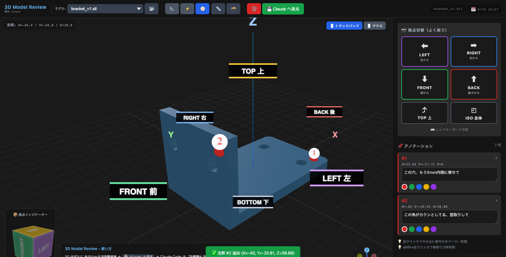

# 3D Model Review

**ブラウザで3Dモデルに右クリック注釈を打って、その座標ごとAIコーディングエージェントに投げ返すツール。**

> A local 3D model viewer that lets you right-click annotations onto an STL and hand the
> picked coordinates back to your AI coding agent. Built for the
> "model in code → review in browser → fix in code" loop. UI is in Japanese.

コードで3Dモデルを作っていると、直したい箇所を言葉で伝えるのが一番のボトルネックになる。
「ここの角、もうちょっと丸めて」の *ここ* が伝わらない。レンダリング画像を見せ合っても、
結局どの面の話なのかで往復が発生する。

このツールはそこだけを解く。ブラウザでモデルを回して、直したい場所を**右クリックで刺す**。
刺した点の座標・法線・コメントがJSONで書き出されるので、エージェントに「注釈読んで」と言えば、
どの面のどの位置の話なのかが一意に伝わる。



---

## 必要なもの

- Python 3.10 以上（**標準ライブラリのみ**。pip install 不要）
- WebGLが動くブラウザ

three.js はリポジトリに同梱しているので、ネットワークがなくても動く。

## 使い方（単体ツールとして）

```bash
git clone https://github.com/noakouji/3d-model-review.git
cd 3d-model-review
bash viewer/start.sh --models /path/to/your/stl_dir
```

ブラウザが自動で開く。`.stl` を置いたディレクトリを指すだけでいい。

作業ディレクトリ単位のワークスペースで管理したい場合は、ディレクトリを渡す:

```bash
bash viewer/start.sh /path/to/project
```

`~/.model-review/workspaces/<slug>/models/` に置いた STL が表示される。
slug は作業ディレクトリのパスから決まるので、**案件ごとにモデルが混ざらない**。

主なオプション:

| オプション | 意味 |
|---|---|
| `--models DIR` | STL を直接読むディレクトリ |
| `--workspace DIR` | 作業ディレクトリ（ワークスペースを決める） |
| `--port N` | 開始ポート。埋まっていたら +25 まで自動探索（既定 8765） |

## 操作

| 操作 | 動作 |
|---|---|
| 左ドラッグ | 回転 |
| 右ドラッグ | パン |
| ホイール | ズーム |
| **右クリック** | **注釈マーカーを配置** |
| Shift + クリック | 最寄りの注釈を削除 |

注釈は色で意図を分類する: 🔴 削る / 🟢 追加 / 🔵 測定 / 🟡 注意 / 🟣 相談

## AIコーディングエージェントに渡す

「💾 Claude へ送る」を押すと、注釈が JSON で書き出される。

```
~/.model-review/workspaces/<slug>/annotations.json
```

あとはエージェントに **「注釈読んで」** と言うだけ。

```json
{
  "timestamp": "2026-08-16T14:30:00Z",
  "file": "bracket_v3.stl",
  "annotations": [
    {
      "id": 1,
      "coords": { "x": 20.0, "y": 15.0, "z": 30.0 },
      "normal": { "x": 0.0, "y": 0.0, "z": 1.0 },
      "color": "#dc2626",
      "color_meaning": "赤 (削る)",
      "comment": "ここがカクンとしてる、もっと斜めに"
    }
  ]
}
```

送信のたびに `annotations_history/` へも積まれるので、指摘の経緯が残る。

## Claude Code のスキルとして使う

このリポジトリはそのままスキルディレクトリになっている。

```bash
git clone https://github.com/noakouji/3d-model-review.git ~/.claude/skills/3d-model-review
```

これで「3Dモデル作って」「注釈読んで」に反応して、モデリング → ビューア起動 → 注釈回収 →
修正のループを回すようになる。手順は [SKILL.md](SKILL.md)、
モデリング側の作法は [references/build123d-workflow.md](references/build123d-workflow.md) にある。

## モデリング側は build123d を推奨

このビューアは **STL を表示するだけなので、モデルの作り方は問わない**。
ただしAIエージェントに作らせるなら、GUIのCADを操作させるより
**コードで書く**ほうが圧倒的に噛み合う。理由と具体的な手順は
[references/build123d-workflow.md](references/build123d-workflow.md) に書いた。

要点だけ:

- **面をIDで指さない。条件で選ぶ。** 「Z座標が最大の面」と書けば、寸法を変えても壊れない
- **見る前に測る。** 体積・バウンディングボックス・干渉体積で数値検証してから絵を見る
- **はめあいは刷るまでわからない。** 本体の前に小さなテストピースを刷る

## データの置き場所

| パス | 中身 |
|---|---|
| `~/.model-review/workspaces/<slug>/models/` | 表示対象の STL |
| `~/.model-review/workspaces/<slug>/annotations.json` | 最新の注釈 |
| `~/.model-review/workspaces/<slug>/annotations_history/` | 注釈の履歴 |
| `~/.model-review/port` | 起動中サーバーの実ポート |

`MODEL_REVIEW_HOME` を設定すればルートごと移せる。

## 制限

- サーバーは `127.0.0.1` にのみバインドする。ローカル専用で、認証はない
- 対応形式は `.stl` のみ
- UI は日本語のみ

## ライセンス

MIT — [LICENSE](LICENSE) を参照。

同梱している three.js は MIT。[THIRD_PARTY_NOTICES.md](THIRD_PARTY_NOTICES.md) を参照。
